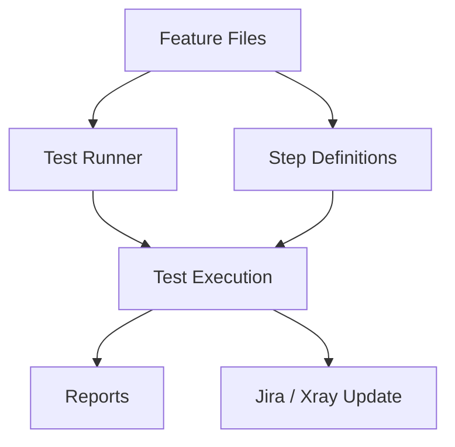

<!-- add Project Logo, if existing -->

# Agile Test Automation Framework

[![Made with love by it@M][made-with-love-shield]][itm-opensource]
[![Java 21][java-shield]][java-url]
[![Cucumber][cucumber-shield]][cucumber-url]
[![TestNG][testng-shield]][testng-url]
[![JUnit 5][junit-shield]][junit-url]
[![MIT License][license-shield]][license-url]

A robust and flexible test automation framework built with Java 21 that simplifies automated testing with Cucumber and a test framework such as TestNG or JUnit.

The Agile Test Automation Framework (ATAF) is designed for agile projects and supports fast setup, maintainable test automation, and integration into modern development workflows. In addition to browser and API testing, it also supports integration with Jira and Xray through their REST APIs.

## Table of Contents

1. [Introduction](#introduction)
2. [Built With](#built-with)
3. [Getting Started](#getting-started)
4. [Usage](#usage)
5. [Running Tests](#running-tests)
6. [Configuration](#configuration)
7. [Reporting](#reporting)
8. [Roadmap](#roadmap)
9. [Documentation](#documentation)
10. [Contributing](#contributing)
11. [License](#license)
12. [Contact](#contact)

## Introduction

This test automation framework is designed to help you quickly set up and execute automated tests for your applications.

It provides:

- Support for both BDD testing with Cucumber and traditional test cases with TestNG and JUnit
- Seamless integration with popular testing libraries
- Easy-to-configure runners for TestNG and JUnit
- Integration with Jira and Xray using their existing REST APIs for test management

## Built With

This project is built with technologies commonly used in modern Java-based test automation:

- Java 21
- Maven
- Cucumber
- TestNG
- JUnit
- Selenium
- Log4j2
- Jira REST API
- Xray REST API

## Getting Started

### Prerequisites

Make sure the following software is installed:

- Java SDK 21 or newer
- Maven
- An IDE such as IntelliJ IDEA or Eclipse

### Installation

Add the following Maven dependencies to your `pom.xml` as needed.

Replace `${version.ataf}` with your preferred version. Omitting the version tag will cause Maven to use the latest available version, which is not recommended.

#### Core package

Required for using ATAF.  
Contains essential functionality for Cucumber and Jira integration, as well as helpful classes for test data and properties.

```xml
<dependency>
    <groupId>de.muenchen.ataf.java</groupId>
    <artifactId>core</artifactId>
    <version>${version.ataf}</version>
</dependency>
```

#### REST package (optional)

Contains classes for API testing.

```xml
<dependency>
    <groupId>de.muenchen.ataf.java</groupId>
    <artifactId>rest</artifactId>
    <version>${version.ataf}</version>
</dependency>
```

#### Web package (optional)

Contains classes for browser-based tests.

```xml
<dependency>
    <groupId>de.muenchen.ataf.java</groupId>
    <artifactId>web</artifactId>
    <version>${version.ataf}</version>
</dependency>
```

### Build the Project

After configuring your Maven project, verify that it builds successfully with:

```bash
mvn clean package
```

### Additional Installation Notes

Add further setup notes and project-specific documentation here or link to your `docs` folder once available.

## Usage

### Writing Cucumber Tests

Create Cucumber scenarios either in Jira or directly as feature files in your repository.  
Also make sure to set the correct Cucumber tags for the corresponding package, such as `@web` or `@rest`. This ensures that the correct hook class is used. In Jira, these tags can be set as labels on the test case issues.

Example:

```gherkin
Feature: Login functionality

  @smoke @web
  Scenario: Successful login with valid credentials
    Given the user is on the login page
    When the user enters valid credentials
    Then the user should be redirected to the dashboard
```

Each Cucumber step must then be implemented in one of your step classes:

```java
import io.cucumber.java.en.Given;
import io.cucumber.java.en.Then;
import io.cucumber.java.en.When;

@Given("the user is on the login page")
public void given_the_user_is_on_the_login_page() {
    // Add precondition code here
}

@When("the user enters valid credentials")
public void when_the_user_enters_valid_credentials() {
    // Add action code here
}

@Then("the user should be redirected to the dashboard")
public void then_the_user_should_be_redirected_to_the_dashboard() {
    // Add verification code here
}
```

### Writing TestNG or JUnit Tests

You can also continue to create test classes independently of Cucumber under `src/test/java`:

```java
import org.testng.annotations.Test;

public class LoginTest {

    @Test
    public void testValidLogin() {
        // Your test code here
    }
}
```

### Provider Configuration

Surefire usually selects the appropriate test framework provider automatically based on the version of TestNG or JUnit found in your project classpath. In some cases, however, you may want to override this behavior manually by adding the required provider dependency to the Surefire plugin.

Example for TestNG:

```xml
<plugin>
    <groupId>org.apache.maven.plugins</groupId>
    <artifactId>maven-surefire-plugin</artifactId>
    <version>3.5.5</version>
    <configuration>
        <trimStackTrace>false</trimStackTrace>
    </configuration>
    <dependencies>
        <dependency>
            <groupId>org.apache.maven.surefire</groupId>
            <artifactId>surefire-testng</artifactId>
            <version>3.5.5</version>
        </dependency>
    </dependencies>
</plugin>
```

### Test Runner Configuration

The framework comes with three preconfigured test runners:

- `BasicJUnitRunner` for JUnit
- `BasicTestNGRunner` for TestNG
- `ParallelTestNGRunner` for parallel Cucumber scenario execution with TestNG

Once you choose a runner, simply extend it:

```java
import ataf.core.runner.BasicTestNGRunner;

public class TestRunner extends BasicTestNGRunner {

}
```

You can also use your own implementation by providing the required lifecycle methods:

```java
import ataf.core.utils.RunnerUtils;

public class CustomTestRunner {

    public void beforeTestSuite() {
        RunnerUtils.setupTestSuite();
    }

    public void afterTestSuite() {
        RunnerUtils.tearDownTestSuite();
    }
}
```

## Running Tests

### Run Cucumber Tests

```bash
mvn clean test -Dcucumber.filter.tags=@smoke
```

### Run Tests with TestNG

```bash
mvn clean test -DsuiteXmlFile=testng.xml
```

### Run Tests with JUnit

```bash
mvn clean test
```

## Configuration

Most test settings are configured using property files.

Property files should be placed in your resources directory, for example:

```txt
src/test/resources
```

### `cucumber.properties`

Configures the behavior of Cucumber.

```properties
# Disables publishing of test reports
cucumber.publish.enabled=false

# Suppresses additional publishing output
cucumber.publish.quiet=true

# Path to the Cucumber feature files
cucumber.features=src/test/resources/features

# Generates both JSON and HTML reports
cucumber.plugin=json:target/cucumber.json,html:target/site/cucumber-pretty

# Comma-separated packages containing Cucumber step classes
cucumber.glue=test.automation.framework.steps,ataf.web.steps
```

### `jira.properties`

These properties are used for Jira integration.

Some values may need to be retrieved through the Jira REST API, depending on your Jira setup.

```properties
# Project ID as a numeric value
jira.test.execution.project.id=12345678

# Summary text used for generated test executions
jira.test.execution.summary=Automatically generated test execution

# Issue type ID used for test executions
jira.test.execution.issuetype.id=-1

# Label used by the framework to identify test executions
jira.test.execution.labels.automation.label=automated

# Environment used for the test; only applies to generated test executions
jira.test.execution.test.environment=test

# Custom field ID for the test environment field in a test execution issue
jira.test.execution.test.environment.customfield.id=customfield_-1

# Custom field ID for the test plan field in a test execution issue
jira.test.execution.test.plan.customfield.id=customfield_-1

# Transition ID to move an issue to in progress
jira.test.execution.transition.id.in.progress=1

# Label used by the framework to identify test executions currently in progress
jira.test.execution.labels.in.progress=inProgress

# Transition ID to move an issue to done
jira.test.execution.transition.id.done=3
```

### `log4j2-test.properties`

Configures the logger behavior.

```properties
appenders=console,threadFile

appender.console.type=Console
appender.console.name=STDOUT
appender.console.layout.type=PatternLayout
appender.console.layout.pattern=[thread-id %T] %d{yyyy-MM-dd HH:mm:ss} %-5p %c{1}:%L - %m%n
appender.console.layout.charset=UTF-8

appender.threadFile.type=RollingFile
appender.threadFile.name=ThreadLog
appender.threadFile.fileName=logs/${ctx:scenario:-default}.log
appender.threadFile.filePattern=logs/${ctx:scenario:-default}-%d{yyyy-MM-dd}.log.gz
appender.threadFile.layout.type=PatternLayout
appender.threadFile.layout.pattern=[thread-id %T] %d{yyyy-MM-dd HH:mm:ss} %-5p %c{1}:%L - %m%n
appender.threadFile.layout.charset=UTF-8
appender.threadFile.policies.type=Policies
appender.threadFile.policies.time.type=TimeBasedTriggeringPolicy

rootLogger.level=info
rootLogger.appenderRefs=stdout,threadLog
rootLogger.appenderRef.stdout.ref=STDOUT
rootLogger.appenderRef.threadLog.ref=ThreadLog
```

### `testautomation.properties`

```properties
# Browser used for test automation (possible values: firefox, chrome, edge)
testautomation.browser=firefox

# Browser version used for the tests
testautomation.browserVersion=140.7.0

# URL of the Selenium Grid hub used for remote test execution
testautomation.seleniumGridUrl=https://selenium.example.com/wd/hub

# Whether a proxy should be used for tests (true/false)
testautomation.boolean.useProxy=true

# Proxy host used for test connections
testautomation.proxyAddress=192.168.100.200

# Proxy port used for test connections
testautomation.int.proxyPort=8080

# Comma-separated list of domains that should bypass the proxy
testautomation.noProxy=my-example-service.example.com

# Default time in milliseconds to wait for scripts and page loads
testautomation.long.defaultScriptAndPageLoadTime=120000

# Default implicit wait time in milliseconds
testautomation.long.defaultImplicitWaitTime=250

# Default explicit wait time in seconds
testautomation.int.defaultExplicitWaitTime=60

# Whether the browser should start in incognito/private mode
testautomation.boolean.useIncognitoMode=true

# Log level for test automation
testautomation.logLevel=INFO

# Browser window width in pixels
testautomation.int.screenWidth=1920

# Browser window height in pixels
testautomation.int.screenHeight=1080

# Directory path containing Firefox extensions used for testing
testautomation.firefoxExtensionDirectory=./src/test/resources/extensions/firefox/

# Jira REST API URLs
testautomation.jiraRestApiUrl=https://jira.example.com/rest/api/2/
testautomation.jiraXrayRestApiUrl=https://jira.example.com/rest/raven/1.0/
```

### Additional Important Properties

The following properties should only be passed at test execution time:

```properties
# Password used to encrypt and decrypt test data at runtime
taf.testDataEncryptionPassword=<your test data password>

# Auth token of the technical Jira user, required for communication with Jira/Xray
auth_token=<your Jira auth token>

# LDAP or technical username used as a fallback for Jira communication and to determine the assignee
username=<technical username>

# Password of the technical user used as a fallback for Jira communication
password=<technical user password>
```

**Because these are credentials, they must never be committed to the repository.**

Example CLI usage:

```bash
mvn clean test -Dtaf.testDataEncryptionPassword=<your test data password> -Dauth_token=<your Jira auth token> -Dusername=<technical username> -Dpassword=<technical user password>
```

### Configuring Environments and Systems

For the framework to work correctly, at least one environment should be defined in your code.

#### Option 1: Static initialization in the test runner class

##### `TestRunner` class

```java
import ataf.core.runner.BasicTestNGRunner;
import test.automation.framework.data.TestData;

public class TestRunner extends BasicTestNGRunner {
    static {
        TestData.init();
    }
}
```

##### `TestData` class with test and integration environments

```java
import ataf.core.data.Environment;
import ataf.core.logging.ScenarioLogManager;

public class TestData {

    public static final Environment TEST_ENVIRONMENT = new Environment("Environment", "TEST");
    public static final Environment INTEGRATION_ENVIRONMENT = new Environment("Environment", "INT");

    public static void init() {
        ScenarioLogManager.getLogger().info(">>>>>>>>>>>>>>>>>>>>>>>>>>>>>>>Start of initializing test data>>>>>>>>>>>>>>>>>>>>>>>>>>>>>>>>>");

        ScenarioLogManager.getLogger().info("Adding systems for TEST");
        TEST_ENVIRONMENT.addSystem("My Example System 1", "https://my-example-system-1-test.example.com/");
        TEST_ENVIRONMENT.addSystem("My Example System 2", "https://my-example-system-2-test.example.com/");
        TEST_ENVIRONMENT.addSystem("My Example System 3", "https://my-example-system-3-test.example.com/");

        ScenarioLogManager.getLogger().info("Adding systems for INT");
        INTEGRATION_ENVIRONMENT.addSystem("My Example System 1", "https://my-example-system-1-int.example.com/");
        INTEGRATION_ENVIRONMENT.addSystem("My Example System 2", "https://my-example-system-2-int.example.com/");
        INTEGRATION_ENVIRONMENT.addSystem("My Example System 3", "https://my-example-system-3-int.example.com/");

        ScenarioLogManager.getLogger().info("<<<<<<<<<<<<<<<<<<<<<<<<<<<<<<<Finished initializing test data<<<<<<<<<<<<<<<<<<<<<<<<<<<<<<<<<<<");
    }
}
```

##### `TestData` class with an empty environment

If your test strategy does not use environments, for example because you only test against productive systems, you can also provide an empty value:

```java
import ataf.core.data.Environment;

public class TestData {
    public static final Environment NO_ENVIRONMENT = new Environment("Environment", "");

    public static void init() {
        // Required for init order of statics
    }
}
```

#### Option 2: Annotated initialization method

You can also use the TestNG lifecycle by annotating the `init()` method with `@BeforeSuite(alwaysRun = true, dependsOnGroups = "beforeTestSuite")`. This code is then executed directly after `ataf.core.runner.BasicTestNGRunner.beforeTestSuite`. This is especially useful if your `TestData` class depends on property values.

```java
import ataf.core.data.Environment;
import ataf.core.logging.ScenarioLogManager;
import org.testng.annotations.BeforeSuite;

public class TestData {

    // Define your environments here

    @BeforeSuite(alwaysRun = true, dependsOnGroups = "beforeTestSuite")
    public void init() {
        ScenarioLogManager.getLogger().info(">>>>>>>>>>>>>>>>>>>>>>>>>>>>>>>Start of initializing test data>>>>>>>>>>>>>>>>>>>>>>>>>>>>>>>>>");

        // Initialize your environments with systems here

        ScenarioLogManager.getLogger().info("<<<<<<<<<<<<<<<<<<<<<<<<<<<<<<<Finished initializing test data<<<<<<<<<<<<<<<<<<<<<<<<<<<<<<<<<<<");
    }
}
```

## Reporting

### Generate Reports

After test execution, reports are generated in the `target/surefire-reports` directory. You will typically find:

- HTML report: a detailed overview of the test execution
- JUnit XML report: XML format for integration into CI tools

If Jira integration is enabled, the corresponding Jira Xray test execution is also updated directly with the test results.

## Roadmap

Possible future enhancements for the framework include:

- Extended support for additional programming languages such as Python, C#, Ruby, and JavaScript
- Additional reusable step libraries
- Improved reporting integrations
- More modular plugins for project-specific extensions

See the [open issues](../../issues) for a full list of proposed features and known issues.

## Documentation

This repository starts with documentation directly in this README.  
As the project evolves, you can move advanced guides into a `docs/` folder and link them here.



GitHub also supports more advanced diagrams using Mermaid.

## Contributing

Contributions are what make the open source community such an amazing place to learn, inspire, and create. Any contributions you make are **greatly appreciated**.

If you have a suggestion that would make this project better, please open an issue with the tag `enhancement`, fork the repository, and create a pull request. You can also simply open an issue to start a discussion.

1. Open an issue with the tag `enhancement`
2. Fork the project
3. Create your feature branch (`git checkout -b feature/AmazingFeature`)
4. Commit your changes (`git commit -m 'Add some AmazingFeature'`)
5. Push to the branch (`git push origin feature/AmazingFeature`)
6. Open a pull request

More details can be added in the [CODE_OF_CONDUCT](CODE_OF_CONDUCT.md) file.

## License

Distributed under the MIT License. See the [LICENSE](LICENSE) file for more information.

## Contact

For questions, issues, or suggestions, please use the repository issue tracker or discussions section.

<!-- project shields / links -->
[made-with-love-shield]: https://img.shields.io/badge/made%20with%20%E2%9D%A4%20by-it%40M-yellow?style=for-the-badge
[itm-opensource]: https://opensource.muenchen.de/
[java-shield]: https://img.shields.io/badge/Java-21-orange?style=for-the-badge
[cucumber-shield]: https://img.shields.io/badge/Cucumber-BDD-brightgreen?style=for-the-badge
[testng-shield]: https://img.shields.io/badge/TestNG-supported-red?style=for-the-badge
[junit-shield]: https://img.shields.io/badge/JUnit-5-blue?style=for-the-badge
[license-shield]: https://img.shields.io/badge/License-MIT-green?style=for-the-badge

[java-url]: https://www.oracle.com/java/
[cucumber-url]: https://cucumber.io/
[testng-url]: https://testng.org/
[junit-url]: https://junit.org/junit5/
[license-url]: ./LICENSE
